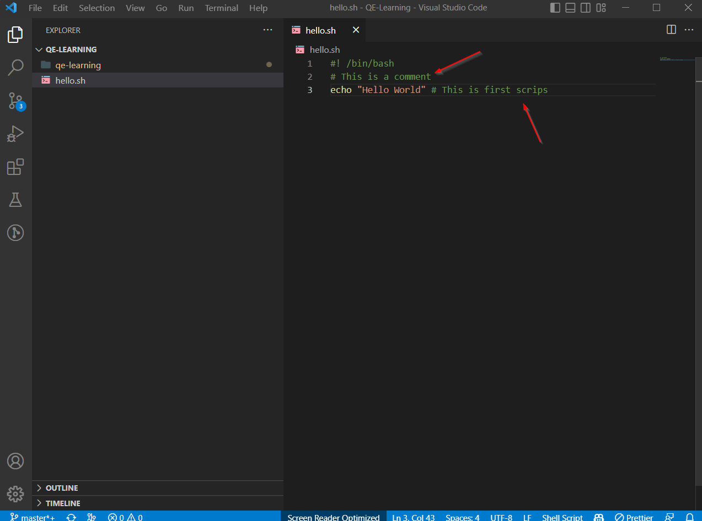
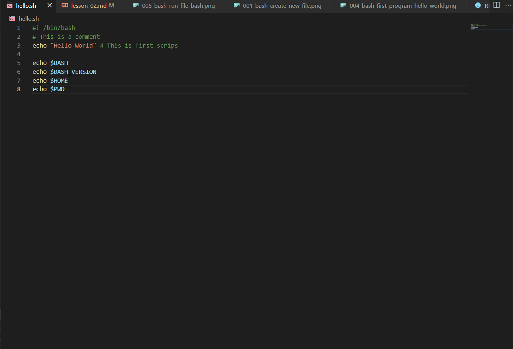
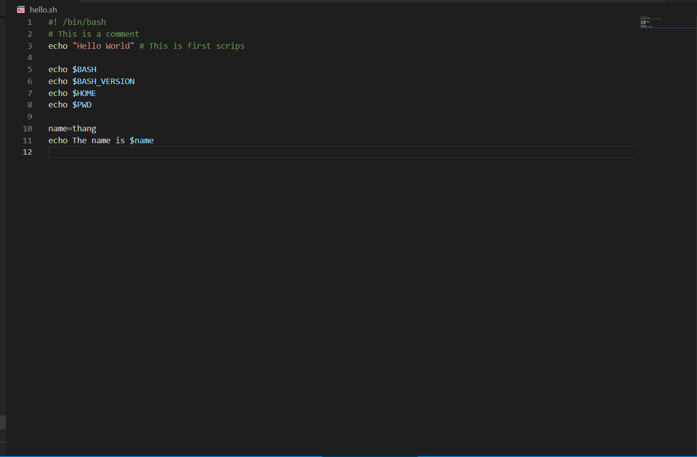
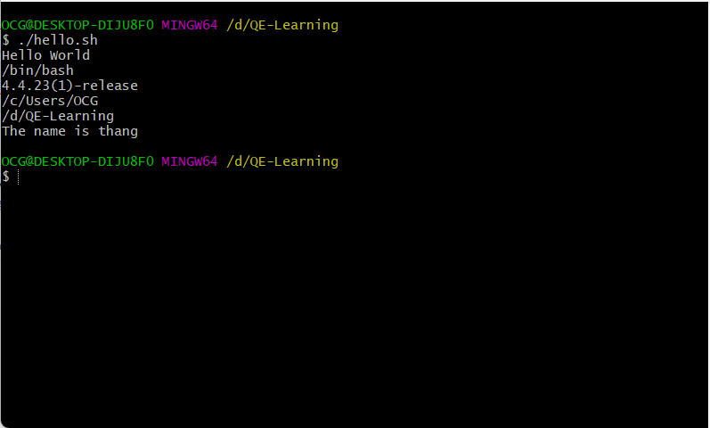

## Lesson 2: Using variables and comments
- Comments là gì ?
    - Là dòng code không được thực thi
    - Dùng để chú thích cho đoạn code đó tại thời điểm khi đoạn code đó được viết ra
- Tại sao phải comments ?
    - Để sau này chúng ta đọc lại code sẽ dễ hiểu hơn
    - Giúp việc maintain dễ hơn
    - Đối với repo lớn với nhiều người code thì việc comment là rất cần thiết
- Cách comment trong bash
  - Bắt đầu comment bằng `#`, phía sau `#` là nội dung comment 
  - Có thể comment trong cùng line với code, những nội dung sau `#` được xem là comment
  

- Biến là gì ?
    - Biến là vùng chứa lưu trữ mốt số dữ liệu bên trong chúng
- Biến trong bash ?
    - Có 2 loại: Biến của system và biến user define
    - Biến của system: các biến hệ thống được tạo và duy trì bởi hệ điều hành Linux hoặc UNIX, vì vậy đây là một số biến được xác định trước do hệ điều hành xác định.
    Gọi biến bằng cú pháp : `$<tên biến>`
    
    - Biến user define: là biến được tạo bởi người dùng, có thể được tạo bằng cú pháp `tên_biến=giá_trị`
    Quy tắc đặt tên biến:
        - Không được bắt đầu bằng số
        - Không được chứa ký tự đặc biệt
        - Không được trùng với tên biến của hệ thống
    Sử dụng biến: 
        - Để truy cập giá trị lưu trong một biến bằng cách đặt ký tự `$` trước tên biến:
    

    Kết quả run chạy thử: 
    