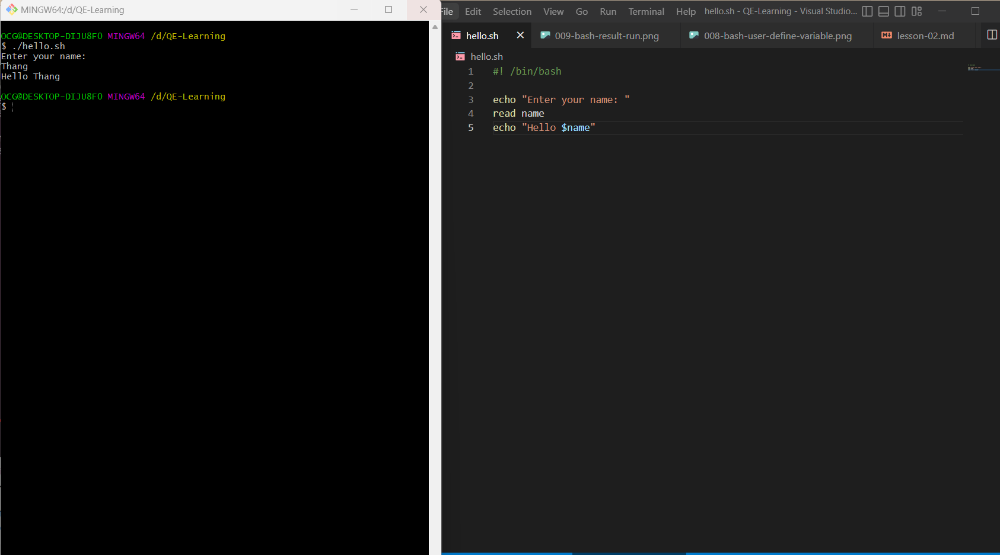
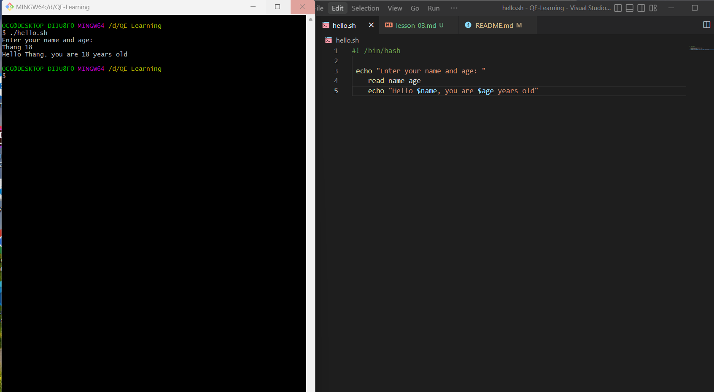
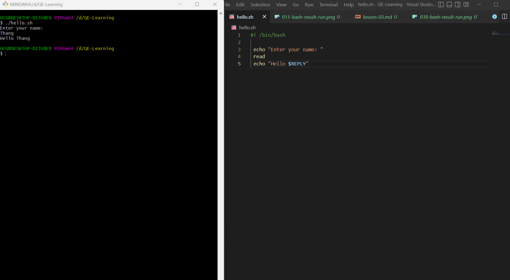
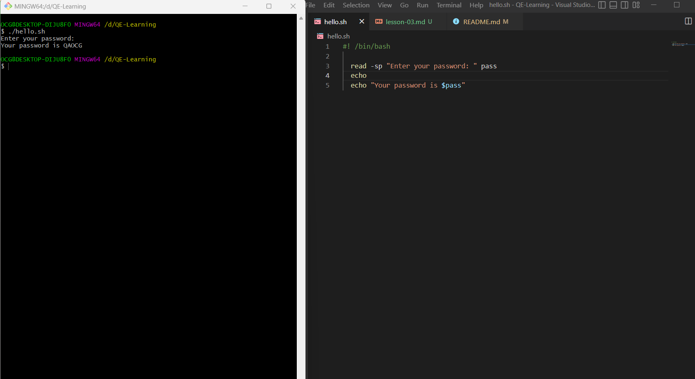
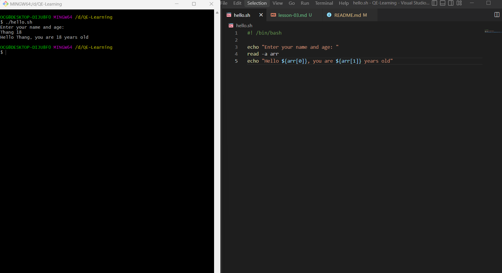

## Lesson 3: Read User Input

- Hôm nay chúng ta sẽ học cách "read user input from the terminal and the script"
- Để read user input, chúng ta sử dụng cú pháp `read <variable_name>`
- Ví dụ:
  ```bash
  #!/bin/bash
  echo "Enter your name: "
  read name
  echo "Hello $name"
  ```
- Kết quả run chạy thử:
  

- Có thể read nhiều biến cùng lúc bằng cách sử dụng cú pháp `read <variable_name1> <variable_name2> ...`

- Ví dụ:
  ```bash
  #!/bin/bash
  echo "Enter your name and age: "
  read name age
  echo "Hello $name, you are $age years old"
  ```
- Kết quả run chạy thử:
  

- Nếu chúng ta không chuyển bất kỳ biến nào bằng lệnh `read`, thì chúng ta có thể chuyển một biến tích hợp có tên là `REPLY`
- Ví dụ:
  ```bash
  #!/bin/bash
  echo "Enter your name: "
  read
  echo "Hello $REPLY"
  ```
- Kết quả run chạy thử:
  

- Dùng p flag để input cùng PROMPT theo cú pháp `read -p PROMPT <variable_name>`
- Ví dụ:
  ```bash
  #!/bin/bash
  read -p "Enter your name: " name
  echo "Hello $name"
  ```
- Kết quả run chạy thử:
  

- Nếu muốn input on silent mode, chúng ta dùng tùy chọn dòng lệnh (-s, -p) theo cú pháp `read -sp PROMPT <variable_name>`
- Ví dụ:
  ```bash
  #!/bin/bash
  read -sp "Enter your password: " pass
  echo
  echo "Your password is $pass"
  ```
- Kết quả run chạy thử:
  

- Chúng ta có thể nhập nhiều đầu vào bằng cách sử dụng cú pháp `read -a <variable_name>`
- Ví dụ:
  ```bash
  #!/bin/bash
  echo "Enter your name and age: "
  read -a arr
  echo "Hello ${arr[0]}, you are ${arr[1]} years old"
  ```
- Kết quả run chạy thử:
  

