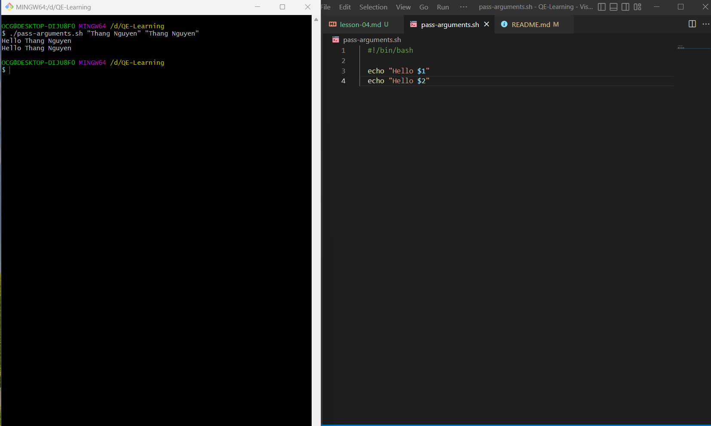
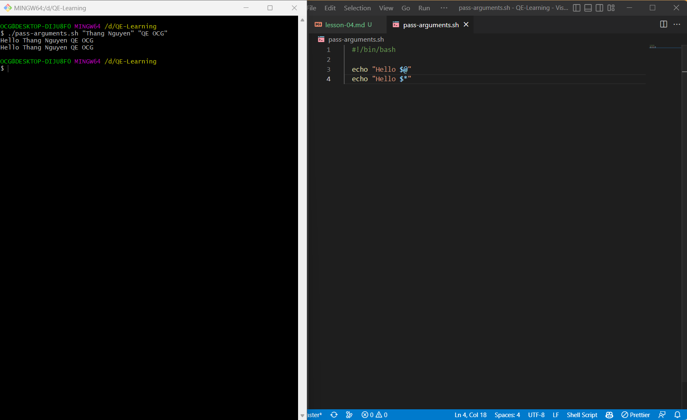
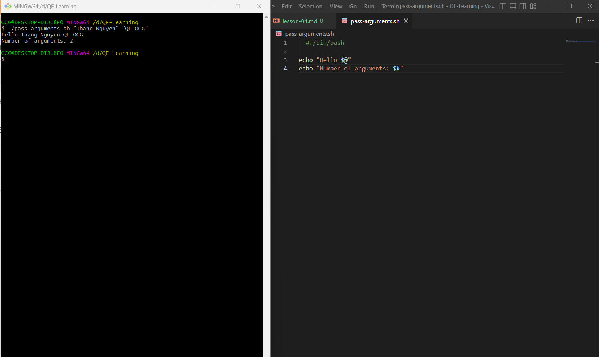

## Lesson 4: Pass Arguments to a Bash-Script

- Hôm nay chúng ta sẽ học cách "pass arguments to a bash-script"

- Arguments là gì?

  - Arguments là các tham số được truyền vào khi chạy file bash-script

- Phân biệt arguments và variables

  - Arguments là các tham số được truyền vào khi chạy file bash-script
  - Variables là các biến được khai báo trong file bash-script

- Tại sao phải truyền arguments?

  - Để thực hiện các công việc khác nhau với các tham số khác nhau

- Để pass arguments, chúng ta sử dụng cú pháp `$0 $1 $2 ...`

  - `$0` là tên file bash-script
  - `$1` là argument thứ nhất
  - `$2` là argument thứ hai
  - ...

- Ví dụ:

  - Tạo file `pass-arguments.sh` với nội dung như sau:

  ```bash
  #!/bin/bash
  echo "Hello $1"
  echo "Hello $2"
  ```

  - Chạy file `pass-arguments.sh` với 2 arguments:

  ```bash
  $ ./pass-arguments.sh "Thang Nguyen" "Thang Nguyen"
  Hello Thang Nguyen
  Hello Thang Nguyen
  ```

  - Kết quả run chạy thử:
    

  - Chúng ta có thể thấy, khi chạy file `pass-arguments.sh` với 2 arguments, chúng ta có thể truy cập được 2 arguments đó bằng cú pháp `$1` và `$2`

  - Chúng ta có thể thấy, khi chạy file `pass-arguments.sh` với 2 arguments, chúng ta có thể truy cập được tất cả các arguments bằng cú pháp `$@` và `$*`
  - Ví dụ:

    - Tạo file `pass-arguments.sh` với nội dung như sau:

    ```bash
    #!/bin/bash
    echo "Hello $@"
    echo "Hello $*"
    ```

    - Chạy file `pass-arguments.sh` với 2 arguments:

    ```bash
    $ ./pass-arguments.sh "Thang Nguyen" "QE OCG"
    Hello Thang Nguyen QE OCG
    Hello Thang Nguyen QE OCG
    ```

    - Kết quả run chạy thử:
      

    - Chúng ta có thể kết hợp giữa available arguments và variables

    - Ví dụ:

      - Tạo file `pass-arguments.sh` với nội dung như sau:

      ```bash
      #!/bin/bash
      echo "Hello $@"
      args=("$@")
      echo "Hello ${args[0]}"
      echo "Hello ${args[1]}"
      ```

      - Chạy file `pass-arguments.sh` với 2 arguments:

      ```bash
      $ ./pass-arguments.sh "Thang Nguyen" "OCG"
      Hello Thang Nguyen OCG
      Hello Thang Nguyen
      Hello OCG
      ```

      - Kết quả run chạy thử:
        

  - Chúng ta có thể dùng `$#` để lấy ra số lượng arguments

    - Ví dụ:

      - Tạo file `pass-arguments.sh` với nội dung như sau:

      ```bash
      #!/bin/bash
      echo "Hello $@"
      echo "Number of arguments: $#"
      ```

      - Chạy file `pass-arguments.sh` với 2 arguments:

      ```bash
      $ ./pass-arguments.sh "Thang Nguyen" "QE OCG"
      Hello Thang Nguyen QE OCG
      Number of arguments: 2
      ```

      - Kết quả run chạy thử:
        
