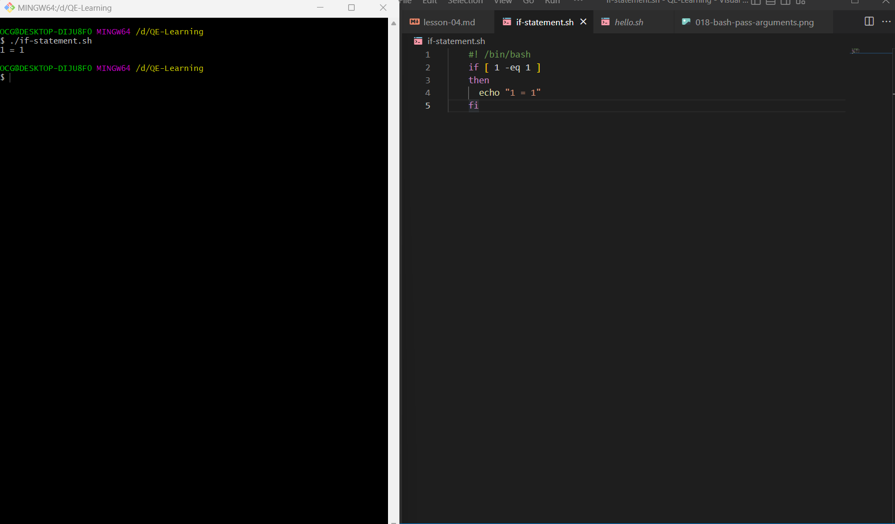
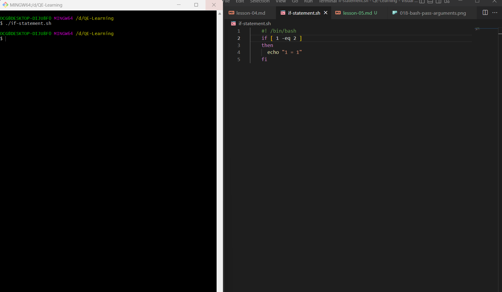
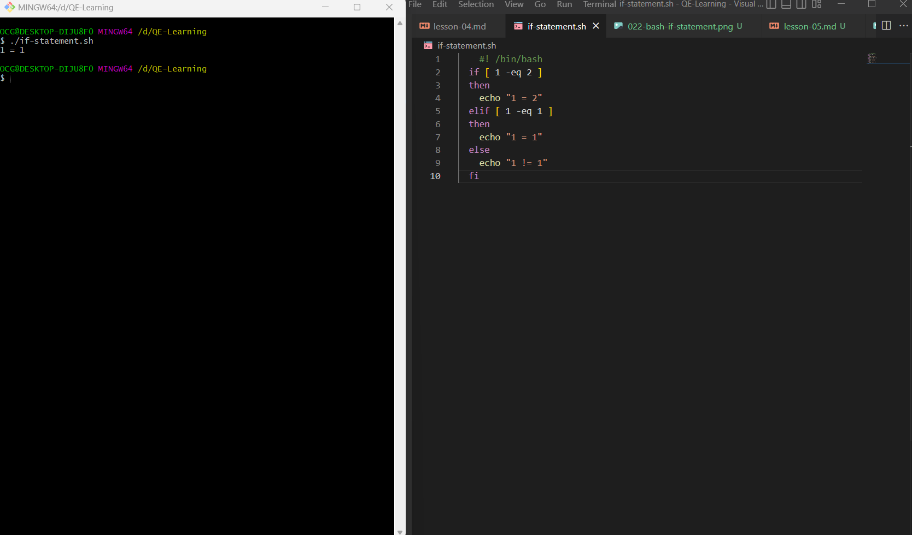

## Lesson 5: If Statement ( If then , If then else, If elif else)

- Hôm nay chúng ta sẽ học cách "if statement"
- If statement là gì?
  - If statement là một câu lệnh điều kiện

### If then

- Cú pháp:

  - if [ condition ]
  - then
  - command1
  - command2
  - command3
  - ...
  - fi

- Comparison Operators (So sánh)
  -- integer comparison

  - `-eq`: equal
  - `-ne`: not equal
  - `-gt`: greater than
  - `-ge`: greater than or equal to
  - `-lt`: less than
  - `-le`: less than or equal to
    -- string comparison
  - `=`: equal
  - `!=`: not equal
  - `>`: greater than (in ASCII alphabetical order)
  - `>=`: greater than or equal to (in ASCII alphabetical order)
  - `<`: less than (in ASCII alphabetical order)
  - `<=`: less than or equal to (in ASCII alphabetical order)
  - `-z`: string is null, that is, has zero length

- Ví dụ:

  - Tạo file `if-statement.sh` với nội dung như sau:

  ```bash
  #!/bin/bash
  if [ 1 -eq 1 ]
  then
    echo "1 = 1"
  fi
  ```

  - Chạy file `if-statement.sh`:

  ```bash
  $ ./if-statement.sh
  1 = 1
  ```

  - Kết quả run chạy thử:
    
  - Khi chạy file `if-statement.sh`, câu lệnh `echo "1 = 1"` được thực thi vì điều kiện `1 -eq 1` đúng
  - Chúng ta có thể thay đổi điều kiện trong file `if-statement.sh` để kiểm tra lại
  - Ví dụ:

  ```bash
  #!/bin/bash
  if [ 1 -eq 2 ]
  then
    echo "1 = 1"
  fi
  ```

  - Chạy file `if-statement.sh`:

  ```bash
  $ ./if-statement.sh
  ```

  - Kết quả run chạy thử:
    

### If then else

- Cú pháp:

  - if [ condition ]
  - then
  - command1
  - command2
  - command3
  - ...
  - else
  - command4
  - command5
  - command6
  - ...
  - fi

- Ví dụ:
  - Tạo file `if-statement.sh` với nội dung như sau:
  ```bash
  #!/bin/bash
  if [ 1 -eq 2 ]
  then
    echo "1 = 1"
  else
    echo "1 != 2"
  fi
  ```
  - Chạy file `if-statement.sh`:
  ```bash
  $ ./if-statement.sh
  1 != 2
  ```
  - Kết quả run chạy thử:
    
  - Chúng ta có thể thấy, khi chạy file `if-statement.sh`, câu lệnh `echo "1 != 2"` được thực thi vì điều kiện `1 -eq 2` sai

### If elif else

- Cú pháp:
  - if [ condition1 ]
  - then
  - command1
  - command2
  - command3
  - ...
  - elif [ condition2 ]
  - then
  - command4
  - command5
  - command6
  - ...
  - else
  - command7
  - command8
  - command9
  - ...
  - fi
- Ví dụ:
  - Tạo file `if-statement.sh` với nội dung như sau:
  ```bash
  #!/bin/bash
  if [ 1 -eq 2 ]
  then
    echo "1 = 2"
  elif [ 1 -eq 1 ]
  then
    echo "1 = 1"
  else
    echo "1 != 1"
  fi
  ```
  - Chạy file `if-statement.sh`:
  ```bash
  $ ./if-statement.sh
  1 = 1
  ```
  - Kết quả run chạy thử:
    
  - Chúng ta có thể thấy, khi chạy file `if-statement.sh`, câu lệnh `echo "1 = 1"` được thực thi vì điều kiện `1 -eq 1` đúng
