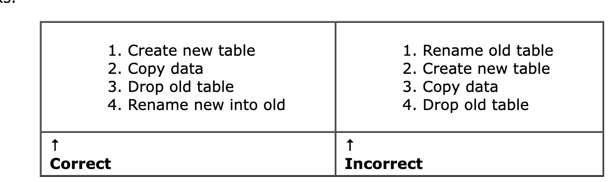

- https://www.sqlite.org/lang_altertable.html
# Overview
- SQLite support tập hợp 1 số lệnh alter table.
- Alter table dùng để:
    - Rename table
    - Rename column
    - Add/ drop column
- Chỗ này có cái visualize hay phết mà ko chụp hết được. Anh em vào đây bấm `show` mà xem thử: [Link](https://www.sqlite.org/lang_altertable.html)
# Alter table rename
- `RENAME TO` dùng để đổi tên table; không dùng được giữa các db khác nhau, chỉ dùng trong 1 db thôi
    - Trường hợp bảng rename có trigger hoặc index, thì trigger, index vẫn được đính vào bảng sau khi rename xong.
- ** Compatibility note **: phiên bản 3.25, 3.26 nên dùng config PRAGMA legacy_alter_table=ON để hoạt động ổn định (liên quan tới việc move attached trigger, indices).
- Từ bản 3.25 trở đi, table được rename thì trigger và view liên quan cũng sẽ được đổi tên cùng.
- Đại khái nói về config PRAGMA, nếu on/off với các version khác nhau thì hiệu ứng thế nào.
- // TODO: đọc thêm về PRAGMA và quay lại đây update

# Alter table rename column
- `RENAME COLUMN TO` dùng để đổi tên cột. Giống SQL thường
# Alter table add column
- `ADD COLUMN` Dùng để thêm cột vào bảng có sẵn.
- Column mới luôn append vào cuối cùng trong danh sách các cột.
- Cột mới cần đảm bảo:
    - Không có PRIMARY KEY hoặc UNIQUE constrain.
    - không có default value CURRENT_TIME, CURRENT_DATE, CURRENT_TIMESTAMP hoặc "an expression in parentheses" (???)
    - Nếu cột có NOT NULL hoặc khoá ngoại thì phải định nghĩa default value khác NULL.
    - Cột không dùng cú pháp GENERATED ALWAYS ... STORED, nhưng VIRTUAL thì được (???)
- Khi add column có CHECK constraint hoặc NOT NULL ở GENERATED COLUMN thì sẽ được test lại trên toàn bộ các row có sẵn. Nếu constrains fail thì câu lệnh ADD COLUMN sẽ fail. Giống SQL thường.
- Với alter rename hoặc add column mà ko có constrain thì execution time của alter command không phụ thuộc vào số lượng dữ liệu (table có 10m record và table có 1 record có execution time ngang nhau).

# Alter table drop column
- `DROP COLUMN` dùng để remove 1 cột khỏi bảng, xoá cột khỏi table definition và rewrite lại nội dung table: purge data của cột này đi.
- `DROP COLUMN` không dùng được với column có primary key và có unique constrain.
- `DROP COLUMN` có thể fail trong 1 số trường hợp sau đây:
    - Cột là PK hoặc là 1 phần của PK
    - Cột có unique constrain
    - Cột được index
    - Cột nằm trong partial index
    - Cột nằm trong mệnh đề CHECK constraint not associated with the column being dropped.
    - Cột nằm trong FK constraint.
    - Cột nằm trong generated column
    - Cột xuất hiện trong trigger hoặc view
## How it works
- SQLite lưu schema ở dạng plain text. Dùng DROP COLUMN command (và tất cả các command khác thuộc hạng mục ALTER TABLE) sẽ sửa text này và re-parse lại toàn bộ schema.
- Command này sẽ thành công khi toàn bộ text được thay đổi và parse thành công.

# Disable error checking using PRAGMA writable_schema=ON
- Thường thì alter table sẽ fail nếu có lỗi trong quá trình parse lại schema (sau khi alter).
    - Ví dụ rename tbl1 -> tbl1neo nhưng lại có view và trigger liên quan -> parse fail -> command alter sẽ fail
- Từ bản 3.38, có thể sử dụng option PRAGMA writeable_schema=ON để ignore error.

# Making other kinds of table schema changes
- SQLite altering thì chỉ support các command như "rename table", "rename column", "add column", "drop column". Tuy nhiên thì các ứng dụng có thể kết hợp kèm những câu lệnh khác để tạo ra 1 tổ hợp các câu lệnh alter.
- Ví dụ dưới đây thay đổi schema của bảng X:
1. Disable foreign key constrains, sử dụng PRAGMA foreign keys=OFF
2. Start transaction
3. Backup lại các index, trigger và view của table X. Có thể dùng lệnh `SELECT type, sql from sqlite_schema WHERE tbl_name='X'`
4. Tạo bảng mới `new_X`
5. Transfer data từ bảng X sang new_X bằng câu lệnh `INSERT INTO new_X SELECT ... FROM X`.
6. Drop bảng X đi
7. Rename bảng new_X thành X, sử dụng `ALTER TABLE new_X RENAME TO X`.
8. Tạo các index, trigger và view tương ứng đã backup lại ở step 3.
9. Nếu view nào liên quan đến table X mà bị ảnh hưởng, drop đi và tạo lại.
10. Sử dụng PRAGMA foreign key check để verify chắc chắn rằng schema change sẽ không làm ảnh hưởng tới foreign key.
11. Commit transaction.
12. Enable lại foreign key constrain check (đã bị tắt ở bước 1)

- **Lưu ý**: Hãy chắc chắn rằng bạn đã làm đúng thứ tự nhé. Thử xét ví dụ dưới đây:

- Trông thì có vẻ giống nhau đấy. Nhưng khác nha:
    - Quả rename table bên phải có thể gây ra issue, đặc biệt có sự thay đổi ở các version như 3.25 và 3.26 chẳng hạn.
    - Quả bên trái tín hơn, tạo ngon lành cành đào rồi mới drop
- Thực sự tôi cũng éo hiểu lắm đâu. Tự dưng lằng ngoằng vkl ạ. rename xong SQLite tự làm mẹ đi cho nhanh, khổ vl.

# Why alter table is such a problem for SQLite
